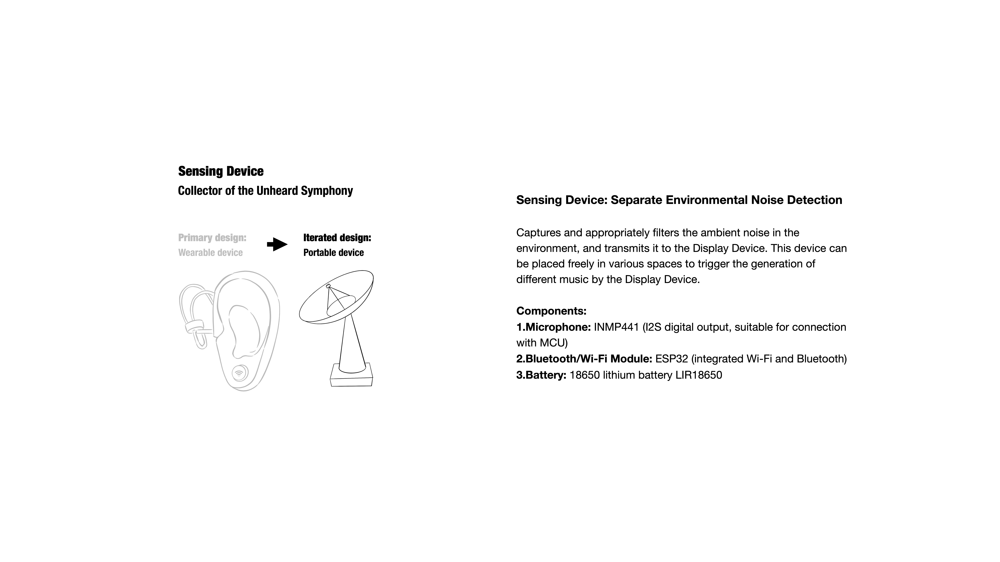
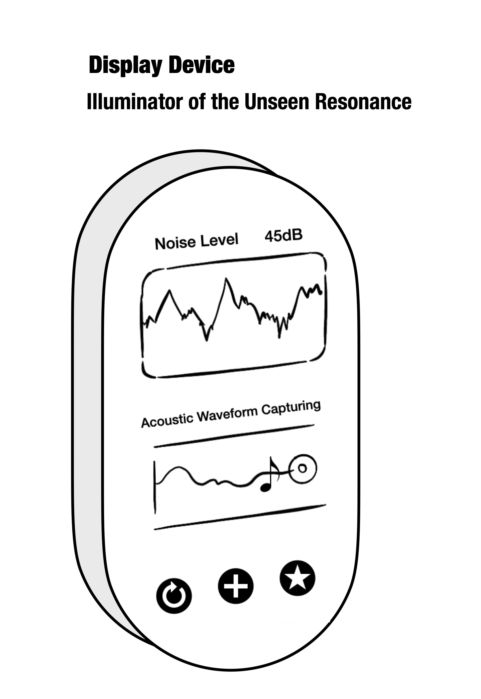
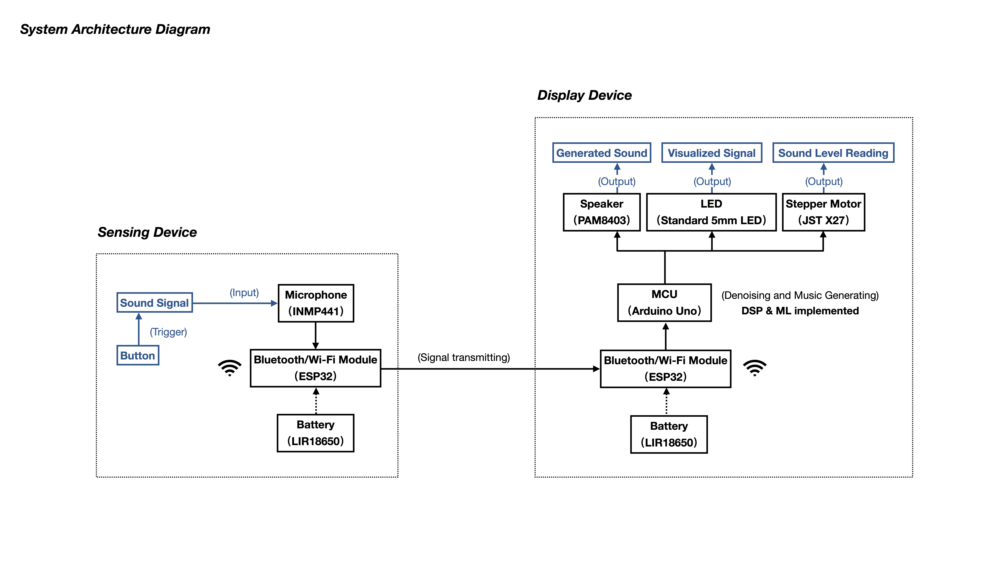

# Echoes of Space

## Cecilia Hung (2320001)

For a detailed view of the power consumption calculations and system profiles, you can view the spreadsheet here:
[View the Power Consumption Spreadsheet](https://docs.google.com/spreadsheets/d/1GH_dmqcpy9LyMxHUE3kLtBWBAWlxp0ul/edit?usp=sharing&ouid=112464995598441446363&rtpof=true&sd=true)
This spreadsheet includes all the power metrics used in the project and the estimated days of use for each component.

### Separate Environmental Noise Detection + Interactive Environmental Music Creation Device

Sensing Device: Captures and appropriately filters the ambient noise in the environment, and transmits it to the Display Device. This device can be placed freely in various spaces to trigger the generation of different music by the Display Device.

Display Device: Based on the noise patterns in the environment, generates a short piece of music using a specified algorithm and outputs it.

### Display Device: Illuminator of the Unseen Resonance

- **Primary Design**: Wearable device
- **Iterated Design**: Portable device

### Sensing Device: Whisperer of the Unheard Symphony

- **Function**: Captures and filters ambient noise, transmits to Display Device. Can be placed in various spaces.

### Components

- **Sensing Device**

  - Microphone: INMP441
  - Bluetooth/Wi-Fi Module: ESP32
  - Battery: 18650 lithium battery LIR18650

- **Display Device**

  - MCU: Arduino Uno or Raspberry Pi 4
  - Bluetooth/Wi-Fi Module: ESP32
  - Battery: 18650 lithium battery LIR18650
  - Speaker: PAM8403
  - LED: Standard 5mm LEDs or 5050 SMD LEDs.
  - Stepper Motor: JST X27
  - Button: KSMC6 Tactile Switches 6mm Top Push

### System Architecture Diagram

