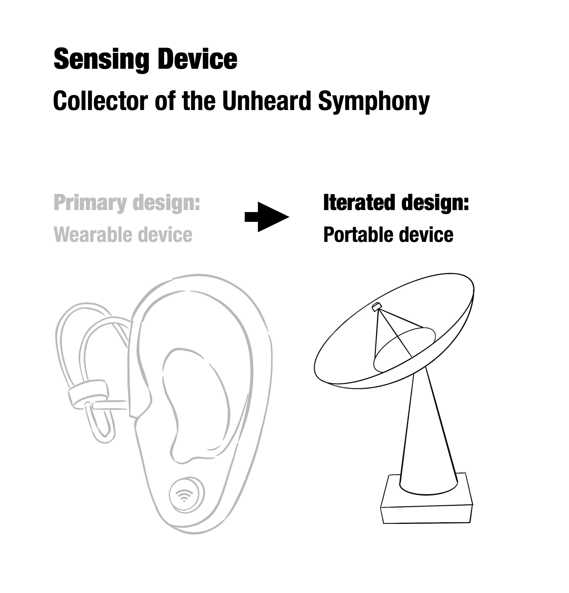
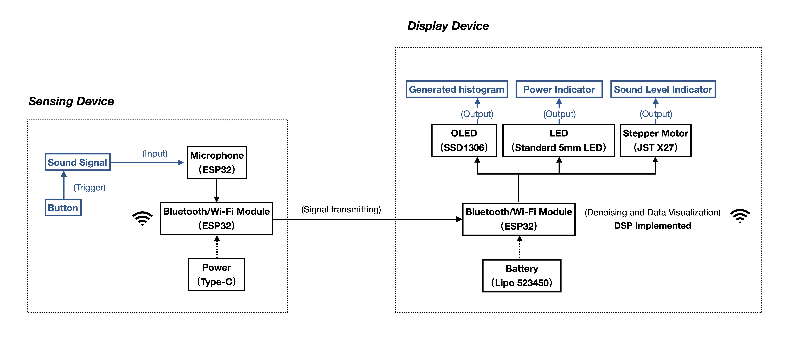

# Echoes of Space

## Cecilia Hung (2320001)

For a detailed view of the power consumption calculations and system profiles, you can view the spreadsheet here:
[View the Power Consumption Spreadsheet](https://docs.google.com/spreadsheets/d/1GH_dmqcpy9LyMxHUE3kLtBWBAWlxp0ul/edit?usp=sharing&ouid=112464995598441446363&rtpof=true&sd=true)
This spreadsheet includes all the power metrics used in the project and the estimated days of use for each component.

### Sensing the Unseen: A Symphony in Silence

In the vast tapestry of everyday life, sounds weave invisible threads, creating a symphony often unheard and unseen. "Echoes of Space" is an odyssey into making the imperceptible palpable, visualizing the whispers and roars of our environment, and transforming them into a visual serenade.

### Sensing Device: Whisperer of the Unheard Symphony

The Sensing Device is engineered to capture ambient noise with precision and transmit this data for further processing. It serves as the primary data collection unit in diverse settings.

### Display Device: Illuminator of the Unseen Resonance

The Display Device is tasked with receiving acoustic data and rendering it into a visual format. It utilizes a range of components to articulate the nuances of environmental sound.

### Components

- **Sensing Device**

  - Microcontroller: Seeed Xiao ESP32S3
  - Interface: Adafruit Tactile Switch Buttons (12mm Square, 6mm Tall)

- **Display Device**

  - Microcontroller: Seeed Xiao ESP32S3
  - Display: OLED SSD1306
  - User Interface: Adafruit SPDT Slide Switch
  - Output Actuator: Stepper Motor (JST X27.168)
  - Power Source: 3.7V Lipo Battery 1000mAh

### System Architecture Diagram

